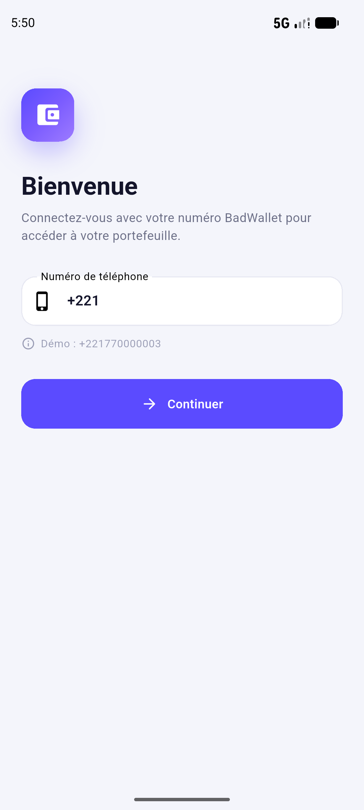
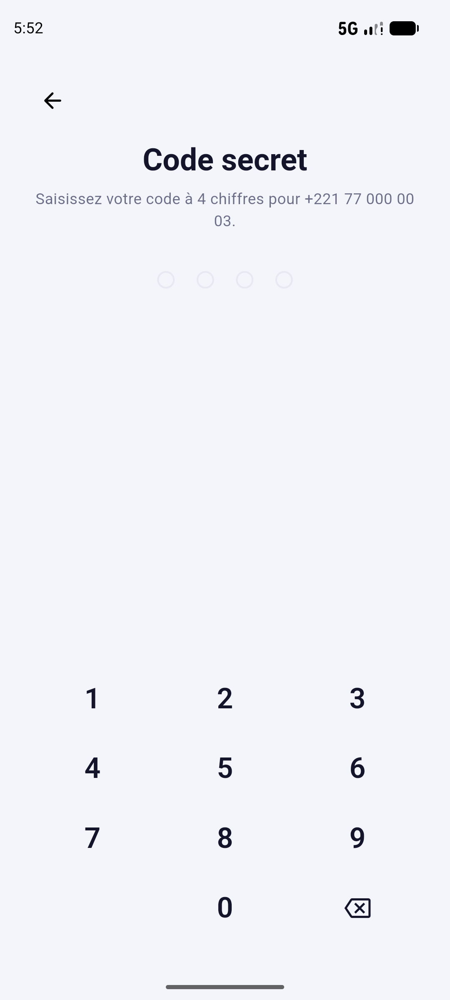
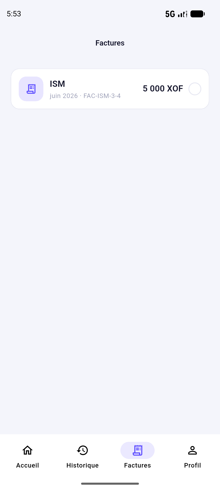
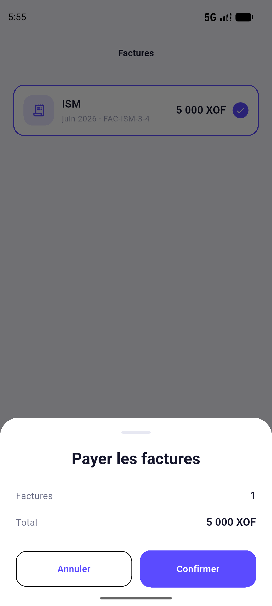
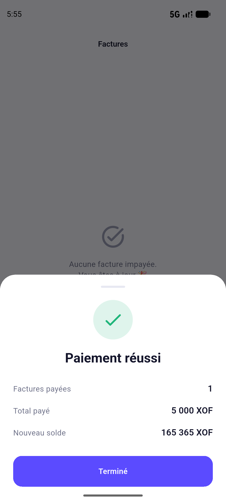
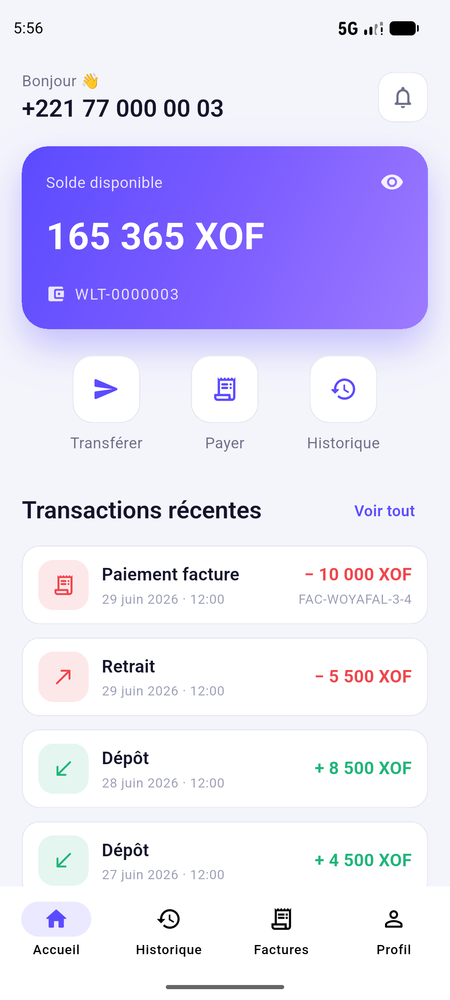
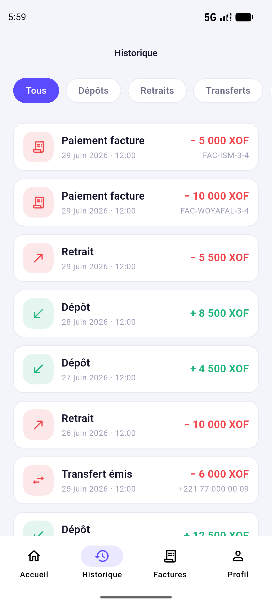

# BadWallet — Application mobile Flutter

Application mobile « Consumer » de portefeuille électronique (style Wave / Orange Money),
développée en Flutter. Elle permet à un client BadWallet de consulter son solde, d'envoyer
de l'argent, de payer ses factures et de suivre l'historique de ses transactions.

L'application consomme la **BadWallet API** (`http://localhost:8080`) et son service de
factures.

## Fonctionnalités

- **Authentification / Onboarding** : splash animé, connexion par numéro de téléphone
  (identifiant BadWallet) et code à 4 chiffres, session conservée localement
  (`flutter_secure_storage`).
- **Tableau de bord** : solde affiché en grand et masquable, actions rapides
  (Transférer / Payer / Historique), liste des 5 dernières transactions.
- **Transfert d'argent** : saisie du destinataire et du montant via un pavé numérique
  personnalisé, écran de confirmation puis reçu.
- **Paiement de factures** : factures impayées du mois en cours par fournisseur (ISM,
  WOYAFAL), sélection multiple par cases à cocher et paiement en lot.
- **Historique** : toutes les transactions avec filtres par type et code couleur
  (vert pour les entrées, rouge pour les sorties).
- **Profil** : informations du portefeuille et déconnexion.

## Captures d'écran

<table>
  <tr>
    <td align="center"><br/>Connexion</td>
    <td align="center"><br/>Code PIN</td>
    <td align="center"><br/>Tableau de bord</td>
    <td align="center"><br/>Factures</td>
  </tr>
  <tr>
    <td align="center"><br/>Confirmation</td>
    <td align="center"><br/>Paiement réussi</td>
    <td align="center"><br/>Solde mis à jour</td>
    <td align="center"><br/>Historique</td>
  </tr>
</table>

## Architecture

Organisation **feature-first** :

```
lib/
├── core/                 # Thème, constantes API, client HTTP, utils, widgets réutilisables
│   ├── constants/        # ApiConstants (construction des URLs)
│   ├── network/          # ApiClient (HTTP + gestion d'erreurs), ApiException
│   ├── state/            # ViewStatus (idle / loading / success / error)
│   ├── theme/            # AppColors, AppTheme
│   ├── utils/            # Formatters (devise XOF, téléphone, dates)
│   └── widgets/          # Boutons, états (loader/erreur/vide), pavé numérique, tuile de transaction
├── features/
│   ├── auth/             # Session, splash, connexion
│   ├── dashboard/        # Tableau de bord
│   ├── transfers/        # Transfert
│   ├── bills/            # Factures
│   ├── history/          # Historique
│   ├── home/             # Shell de navigation (bottom navigation)
│   └── profile/          # Profil
├── models/               # Wallet, WalletTransaction, Facture, Page, réponses API
├── app.dart              # MaterialApp + injection des providers
└── main.dart             # Point d'entrée
```

**Gestion d'état : `provider`**. Chaque fonctionnalité expose un `ChangeNotifier`
(`SessionProvider`, `DashboardProvider`, `TransferProvider`, `BillsProvider`,
`HistoryProvider`) qui pilote un état `ViewStatus` (Loading / Loaded / Error) et notifie
l'interface. Le `SessionProvider` centralise l'identité (numéro + code portefeuille) et le
solde, qui se met à jour automatiquement après chaque opération sans rechargement.

La couche réseau est isolée dans `ApiClient` : un seul point pour l'encodage JSON, le
timeout et la traduction des erreurs serveur (`{ "message": ... }`) en messages
utilisateur.

## Démarrage

### Prérequis
- Flutter 3.44+ (canal stable), Dart 3.12+
- Le backend BadWallet en cours d'exécution sur `localhost:8080`

### Lancer l'application
```bash
flutter pub get
flutter run            # choisir l'appareil (émulateur Android conseillé)
```

### Configuration de l'adresse de l'API
L'hôte est déterminé automatiquement dans `lib/core/constants/api_constants.dart` :
- **Émulateur Android** : `http://10.0.2.2:8080` (alias de `localhost` de la machine hôte)
- **Web / iOS / desktop** : `http://localhost:8080`

Pour un **téléphone physique**, remplacer l'hôte par l'adresse IP locale du PC
(ex. `http://192.168.1.10:8080`).

> Le backend n'expose pas de configuration CORS : les appels depuis un navigateur
> (Flutter Web) sont bloqués par la politique du navigateur. L'application est prévue pour
> Android, où cette restriction ne s'applique pas.

### Données de test
Le backend est initialisé avec 10 portefeuilles : numéros `+221770000001` à
`+221770000010` (ex. de démo : **+221770000003**), codes `WLT-0000001` à `WLT-0000010`.

## Génération de l'APK

```bash
flutter build apk --release
```

Le fichier est généré dans `build/app/outputs/flutter-apk/app-release.apk`.
L'icône d'application personnalisée est gérée par `flutter_launcher_icons`
(`dart run flutter_launcher_icons` après modification de l'icône).

## Stratégie Git (GitFlow)

- `main` : version livrable.
- `develop` : intégration des fonctionnalités terminées et testées.
- `feature/*` : une branche par fonctionnalité, fusionnée dans `develop` en `--no-ff`.

## Choix techniques et difficultés

- **Solde via `/balance`** : l'endpoint renvoie un objet `{ phoneNumber, balance, currency }`
  et non un nombre brut — le parsing en tient compte.
- **Factures indexées par `walletCode`** : à la connexion, le portefeuille est récupéré par
  numéro afin d'obtenir son `code`, ensuite utilisé pour interroger les factures.
- **Sens des transactions** : la couleur (entrée/sortie) s'appuie sur le champ `direction`
  (`CREDIT` / `DEBIT`) fourni par l'API, jamais déduit côté client.
- **Paiement en lot** : `pay-factures` n'accepte qu'un service à la fois ; les factures
  sélectionnées sont donc regroupées par fournisseur avant l'envoi.

## Paquets utilisés

`provider`, `http`, `intl`, `google_fonts`, `flutter_secure_storage`, `flutter_animate`,
`shimmer`, `flutter_launcher_icons`.
